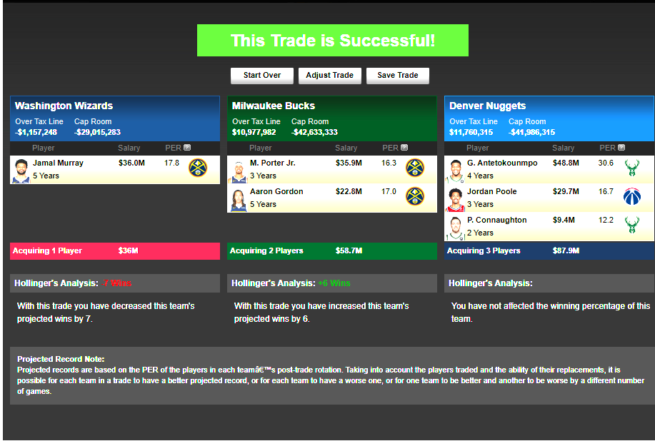

## The FUTURE

The Wizards have a 14 % chance for the number 1 pick and a 52.1 % chance to get a top four pick. Estimating on the safe side its a fair assumption that we will not end up winning the lottery and coming home with Cooper Flagg. We are a cursed and (historically) a terribly run franchise so the idea of getting Cooper Flagg and the Wizards becoming a real competitor in the next 2-5 years is a little hard to swallow, however the way things are shaking out with some of our recent trade partners we could be in position to be the ulitmate trade facilitator and put together a real team of vets and high draft picks who actually want to win more than 20 games!

This is not intended to be a realistic trade but having the Bucks 2028 swap could get us involved as a salary match team to entice the Bucks into a trade. They don't have control of their picks until 2031 so there is real incentive for them to get their swaps and picks back and be somewhat competitive. Any team that trades for Giannis is going to be a contender.

## Washington Wizards Incoming Draft Picks

## 2025 Draft
| Year | Round | Pick | From | Protection Details |
|------|-------|------|------|-------------------|
| 2025 | 1     | -    | Own  | - |
| 2025 | 1     | -    | MEM  | No protections |
| 2025 | 2     | -    | PHX  | No protections |

## 2026 Draft
| Year | Round | Pick | From | Protection Details |
|------|-------|------|------|-------------------|
| 2026 | 1     | -    | PHX  | 1 (See Below) |
| 2026 | 1     | -    | OKC/HOU/LAC | 2 (See Below) |
| 2026 | 2     | -    | CHI  | No protections |
| 2026 | 2     | -    | PHX  | No protections |
| 2026 | 2     | -    | MIN/NYK/NOP/POR | No protections |
| 2026 | 2     | -    | Own  | - |

## 2027 Draft
| Year | Round | Pick | From | Protection Details |
|------|-------|------|------|-------------------|
| 2027 | 1     | -    | Own  | - |
| 2027 | 2     | -    | BKN/DAL | No protections |
| 2027 | 2     | -    | CHI  | Protected 51-60 |
| 2027 | 2     | -    | GSW/PHX | No protections |
| 2027 | 2     | -    | Own  | - |

## 2028 Draft
| Year | Round | Pick | From | Protection Details |
|------|-------|------|------|-------------------|
| 2028 | 1     | -    | MIL/POR | 3 (See Below) |
| 2028 | 1     | -    | PHX/BKN/PHI | 4 (See Below) |
| 2028 | 2     | -    | DEN  | Protected 31-33 |
| 2028 | 2     | -    | Own  | No protections |

## 2029 Draft
| Year | Round | Pick | From | Protection Details |
|------|-------|------|------|-------------------|
| 2029 | 1     | -    | BOS/MIL/POR | No protections |
| 2029 | 1     | -    | Own  | - |
| 2029 | 2     | -    | SAC  | No protections |
| 2029 | 2     | -    | LAL  | No protections |

## 2030 Draft
| Year | Round | Pick | From | Protection Details |
|------|-------|------|------|-------------------|
| 2030 | 1     | -    | GSW  | Protected 1-20 |
| 2030 | 1     | -    | PHX  | 5 (See Below) |
| 2030 | 2     | -    | PHX/POR | No protections |

## 2031 Draft
| Year | Round | Pick | From | Protection Details |
|------|-------|------|------|-------------------|
| 2031 | 1     | -    | Own  | - |
| 2031 | 2     | -    | Own  | - |

1 - WAS has the right to swap its 2026 1st round pick, protected for selections 9-30, for PHX's 2026 1st round pick; ORL then has the right to swap its 2026 1st round pick for the less favorable of the PHX pick and the WAS pick if conveyable; MEM then has the right to swap its 2026 1st round pick for the least/less favorable of the PHX pick, the WAS pick if conveyable and the ORL pick and CHA will receive the least favorable of these; if the WAS pick is not conveyable, then the commitment to WAS will be lifted and ORL will instead have the right to swap its pick for the PHX pick (via PHX to CHA)

2 - OKC will receive the two most/more favorable of its 2026 1st round pick, HOU's 2026 1st round pick protected for selections 1-4 and the LAC' 2026 1st round pick and WAS will receive the least/less favorable of these; if the HOU pick falls within its protected range and is therefore not conveyed, then HOU will instead convey its 2026 2nd round pick to OKC

3 - POR will receive the more favorable of its 2028 1st round pick, protected for selections 15-30 if POR has not conveyed a 1st round pick to CHI by 2027, and MIL's 2028 1st round pick; WAS will receive the more favorable of (1) the more favorable of (a) WAS's 2028 1st round pick and (b) the least/less favorable of BKN's 2028 1st round pick, PHI's 2028 1st round pick, which would be protected for selections 1-8 if PHI does not convey a 1st round pick to BKN in 2027 and otherwise conveyable if PHI has conveyed a 1st round pick to OKC by 2026, and PHX's 2028 1st round pick and (2) the less favorable of the MIL pick and the POR pick if conveyable and MIL will receive the less favorable of (1) and (2); if the POR pick is not conveyable, then MIL's commitment to POR will be lifted and WAS will instead have the right to swap for the MIL pick

4 - If (1) PHI's 2028 1st round pick, which would be protected for selections 1-8 and otherwise conveyable to BKN if PHI does not convey a 1st round pick to BKN in 2027 and if PHI has conveyed a 1st round pick to OKC by 2026, is conveyed to BKN and is the third most favorable of PHI, BKN's 2028 1st round pick, PHX's 2028 1st round pick and NYK's 2028 1st round pick and (2) NYK is the most or second most favorable of the four, then BKN will receive the most and third most favorable of the four; in all other scenarios, BKN will receive the most/two most favorable of these; if PHI if conveyed and/or NYK is less favorable than BKN and PHX, then NYK will receive the least favorable of NYK, BKN and PHX; in all other scenarios, NYK will receive the second most favorable of the three; WAS will receive the more favorable of (1) its 2028 1st round pick and (2) the least/less favorable of PHX, BKN and PHI if conveyed and PHX will receive the less favorable of (1) and (2); WAS may swap the pick it receives for MIL or POR (see WAS incoming)

5 - WAS has the right to swap its 2030 1st round pick for PHX's 2030 1st round pick; MEM then has the right to swap its 2030 1st round pick for the less favorable of the PHX pick and the WAS pick

Credit to: https://fanspo.com/nba/teams/Wizards/30/draft-picks

